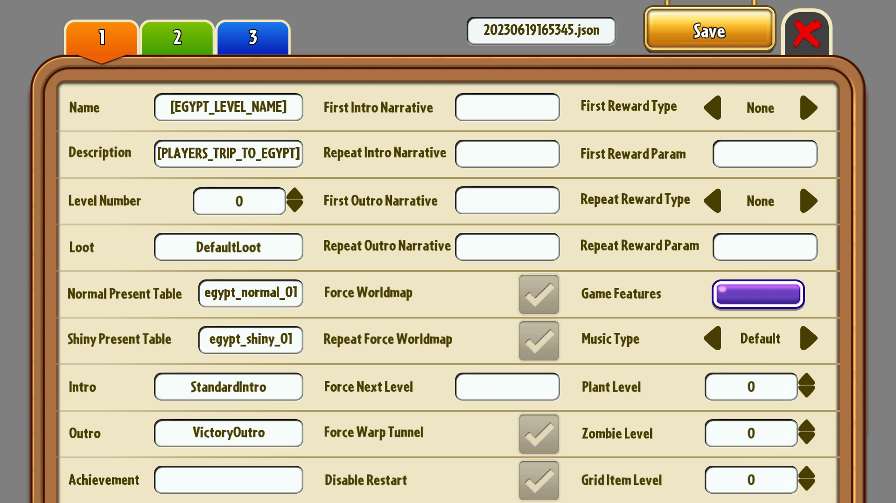
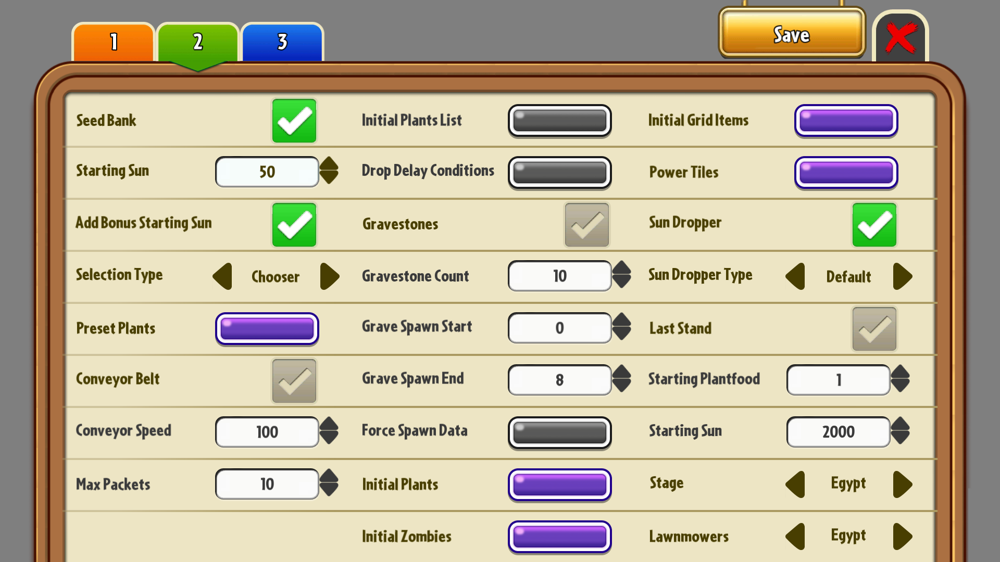

### [Русская Версия](./README_RU.md)

 
 

# Plants vs. Zombies 2 Level Editor

**Plants vs. Zombies 2 Level Editor**, also referred to as **Level Editor**, **PvZ2: LE** or simply **LE**, is a Windows GUI tool for generating PvZ2 levels.
It is written in C++ using SFML and it provides essential functionality for level creation.

## 🛠 State of Development

The project has been archived after being completed and can now be accessed for reference and portfolio purposes. This repository has two branches:

* [``2.0.x``](https://github.com/blazingzephyr/level-editor/tree/2.0.x) branch is the complete stable version of the tool.
* [``2.1.x``](https://github.com/blazingzephyr/level-editor/tree/2.1.x) branch contains work in progress for the next major reimplementation of LE. However, the update has been canceled, so the code is extremely unfinished and unstable.

## 📝 Goals

Originally, when starting this project, I persuaded the following goals:

* Remaking an old low-quality tool I made back in 2020 (Currently referred to as ``1.0``).
* Improving my skills in C++.
* Learning a new multimedia library, that being SFML.
* (Later) making custom UI on SFML without any third-party libraries.

## 📃 Features & Capabilities

Set of features, supported by the tool:

* Core features, such as JSON export.
* Settings for personalization:
  * Fullscreen and Windowed modes with widescreen resolutions (320:180, 640:360, 1280:720, 1920:1080).
  * Custom UI layout support (limited; only Standard layout is included).
  * UI translation support (English and Russian translations are included).
  * UI theming support ('New' and 'Old' themes are included).
  * Miscellaneous secondary options:
    * BGM and Sound Volume adjustment.
    * Export folder location.
    * Etc.

## 🛡 Download

You can get the latest compiled release [here](https://github.com/blazingzephyr/level-editor/releases/tag/2023.01.27-stable).

## 📂 Installation

If you have downloaded the compiled release, the installation is as simple as extracting an archive.

## ⚙ Build from Source

Alternatively, you could build the source yourself using VS2022.

## 💡 Author

* ZaBlazzingZephyrus ([@blazingzephyr](https://github.com/blazingzephyr))

## 💼 Contributors

* MysteriousPersona ([@MysteriousPersona](https://www.youtube.com/@MysteriousPersona))
* Seferiso
* liledix4 ([@liledix4](https://github.com/liledix4))
* BP The Mega Gatling Pea ([@BMegaGPea990](https://github.com/BMegaGPea990))

## 📜 License

The tool and its source code are distributed under the [MIT license](https://opensource.org/license/mit/). See [LICENSE](https://github.com/blazingzephyr/level-editor/blob/2.0.x/LICENSE). External libraries used by Level Editor are distributed under their own licenses.

In short, you are allowed to use this tool for both personal and commercial use, however, you do not have any guarantees.

## 🧾 External Libraries

* [SFML](https://github.com/SFML/SFML) is under the [zlib License](https://github.com/SFML/SFML/blob/master/license.md)
* [minijson_reader](https://github.com/giacomodrago/minijson_reader) is under the [MIT License](https://github.com/giacomodrago/minijson_reader/blob/master/LICENSE.txt)
* [minijson_writer](https://github.com/giacomodrago/minijson_writer) is under the [MIT License](https://github.com/giacomodrago/minijson_writer/blob/master/LICENSE.txt)

## 📸 Screenshots

|  |               |
|:-----------------------------------------------:|:----------------------------------------------------:|
| Title Screen                                    | Level Creation — Page 1                              |
|         |                |
| Level Creation — Page 2                         | Level Creation — Page 3                              |